# Architecture Documentation

## System Overview

The Counterfactual Financial Oracle is a comprehensive financial analysis pipeline that processes financial reports through multiple AI-powered stages to generate validated financial projections and reports.

## High-Level Architecture

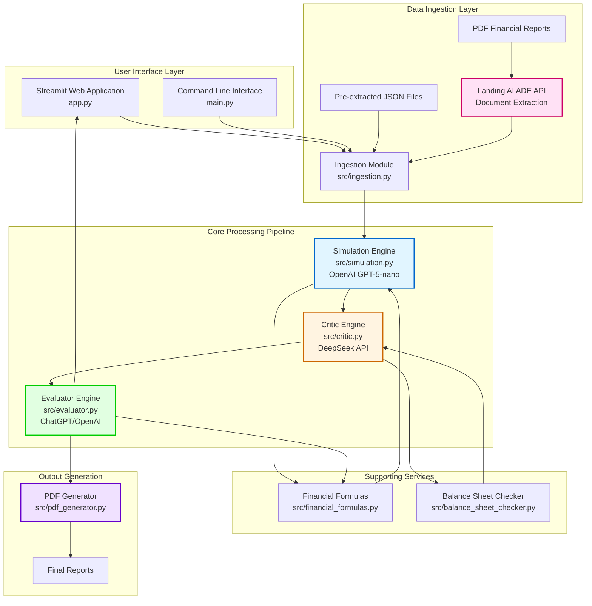

## Detailed Component Architecture

### 1. Data Ingestion Layer

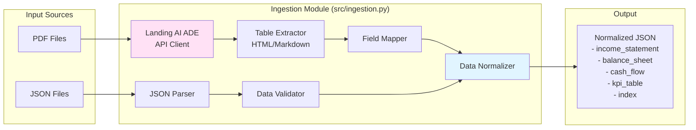

**Key Functions:**
- `extract_from_pdf()`: Extracts data from PDF using Landing AI ADE API
- `extract_from_pdf_bytes()`: Handles PDF bytes directly
- `load_ade_json()`: Loads pre-extracted JSON files
- `normalize_ade_response()`: Normalizes ADE response to standard format
- `validate_report_json()`: Validates report structure
- `extract_kpis()`: Extracts key performance indicators
- `_populate_financials_from_markdown()`: Parses HTML tables from markdown

### 2. Simulation Engine

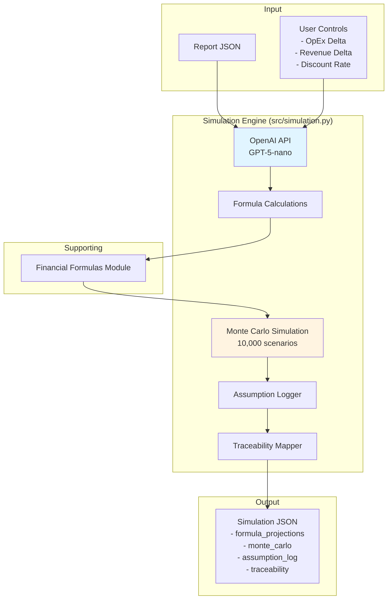

**Key Functions:**
- `run_simulation()`: Main simulation orchestration
- Uses OpenAI API for intelligent formula-driven projections
- Runs 10,000 Monte Carlo scenarios locally
- Generates assumption logs and traceability mappings
- Falls back to local calculations if API fails

**Financial Formulas Used:**
- EBITDA = Revenue - COGS - OpEx
- EBIT = EBITDA - Depreciation - Amortization
- Net Income = (EBIT - Interest + Other Income) × (1 - Tax Rate)
- Free Cash Flow = Cash from Operations - CapEx
- NPV calculation with discount rate
- IRR calculation

### 3. Critic Engine

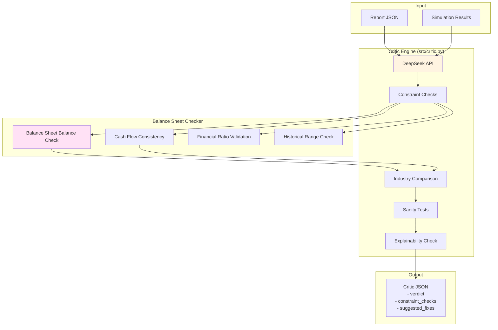

**Key Functions:**
- `run_critique()`: Main critique orchestration
- Uses DeepSeek API for intelligent validation
- Performs constraint checks via `balance_sheet_checker.py`
- Compares against industry averages
- Validates historical ranges
- Provides verdict (approve/revise) and suggested fixes

**Validation Checks:**
- Balance sheet balancing (Assets = Liabilities + Equity)
- Cash flow consistency
- Financial ratios vs industry averages
- Historical range validation
- Growth rate sanity checks
- Margin validation

### 4. Evaluator Engine

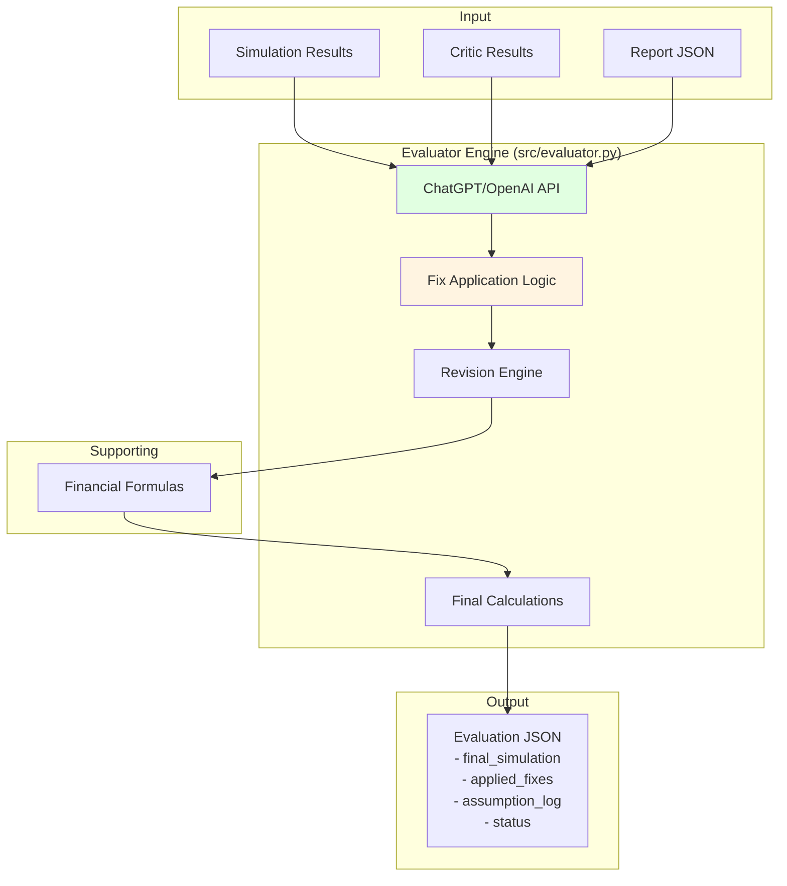

**Key Functions:**
- `evaluate()`: Main evaluation orchestration
- Uses ChatGPT/OpenAI API for intelligent fix application
- Applies critic fixes deterministically
- Recalculates formulas and Monte Carlo if needed
- Generates final assumption log
- Falls back to local fix application if API fails

### 5. PDF Generator

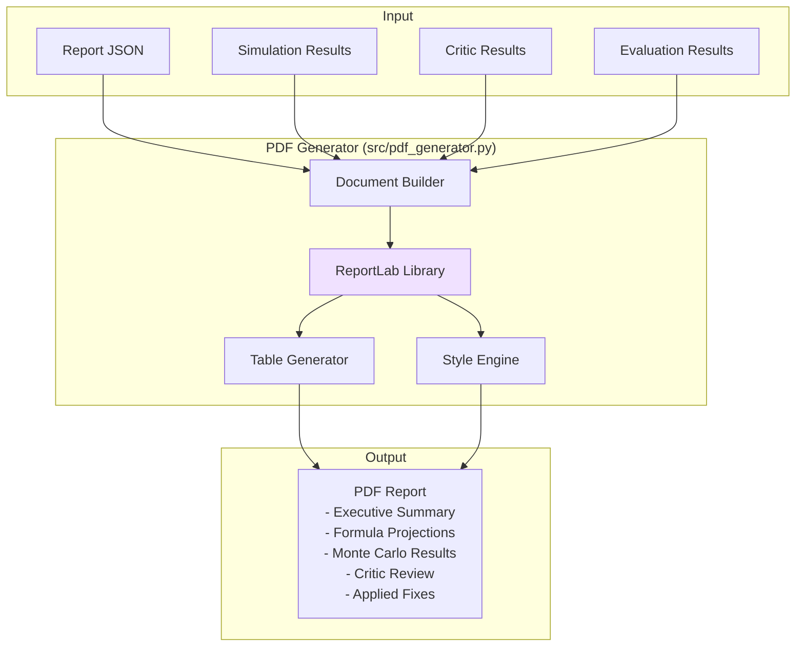

**Key Functions:**
- `generate_report()`: Generates PDF file
- `generate_report_bytes()`: Generates PDF as bytes (for Streamlit)
- `_build_story()`: Builds document structure
- Includes all analysis results, charts, and tables

## Data Flow

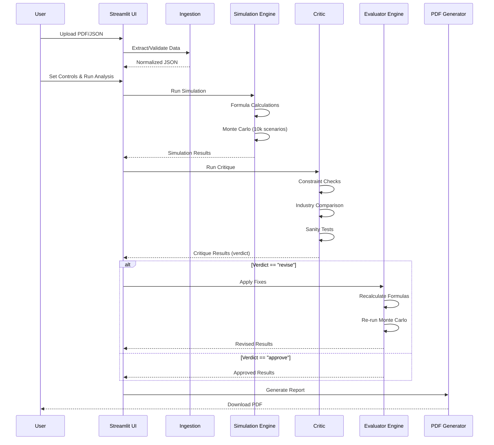

## Module Dependencies

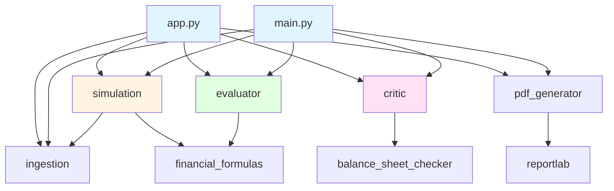

## External API Integration

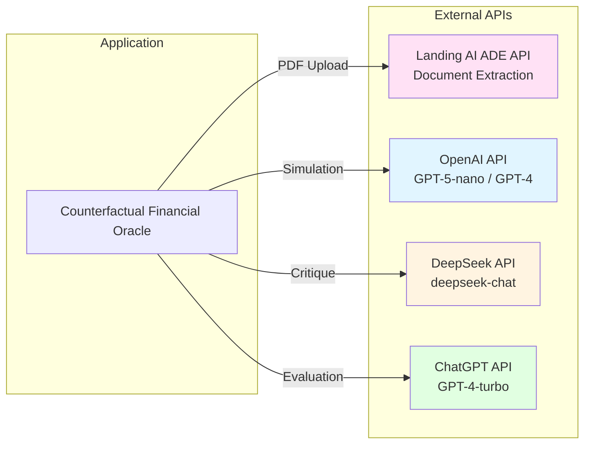

## Error Handling & Fallbacks

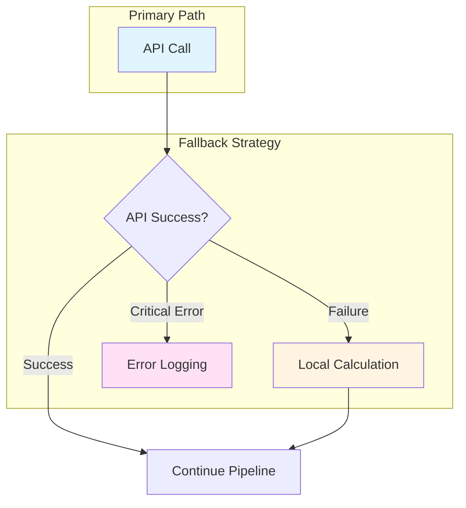

**Fallback Mechanisms:**
1. **Landing AI ADE**: Falls back to HTTP API if SDK fails
2. **OpenAI Simulation**: Falls back to local formula calculations
3. **DeepSeek Critic**: Falls back to local constraint checks
4. **ChatGPT Evaluator**: Falls back to local fix application

## Testing Architecture

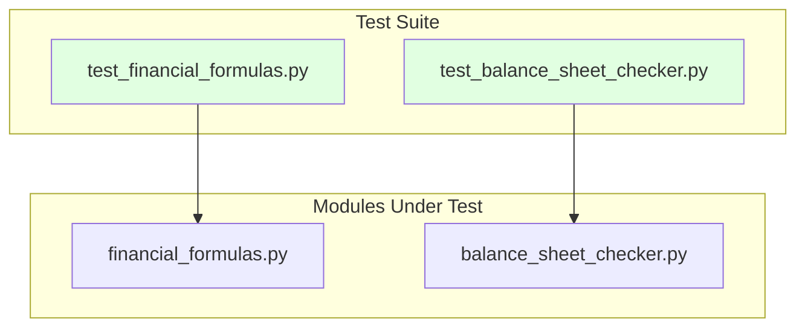

## Security Architecture

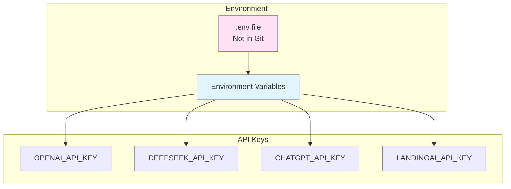

## Performance Considerations

1. **Async Operations**: All API calls use async/await for parallel processing
2. **Local Monte Carlo**: 10,000 scenarios run locally (fast NumPy operations)
3. **Caching**: Session state in Streamlit for intermediate results
4. **Efficient PDF Generation**: ReportLab for fast PDF creation

## Scalability

- **Stateless Design**: Each pipeline run is independent
- **Modular Architecture**: Easy to add new engines or validators
- **API-Based**: Can be containerized and deployed as microservices
- **Streamlit UI**: Can be deployed to Streamlit Cloud or self-hosted

## Future Enhancements

1. **Database Integration**: Store results in database for historical analysis
2. **Batch Processing**: Process multiple reports simultaneously
3. **Advanced Visualizations**: Charts and graphs in PDF and UI
4. **Export Formats**: Excel, CSV, JSON exports
5. **User Authentication**: Secure access to the Streamlit app
6. **Historical Analysis**: Track changes over time
7. **Custom Reports**: User-defined report templates

