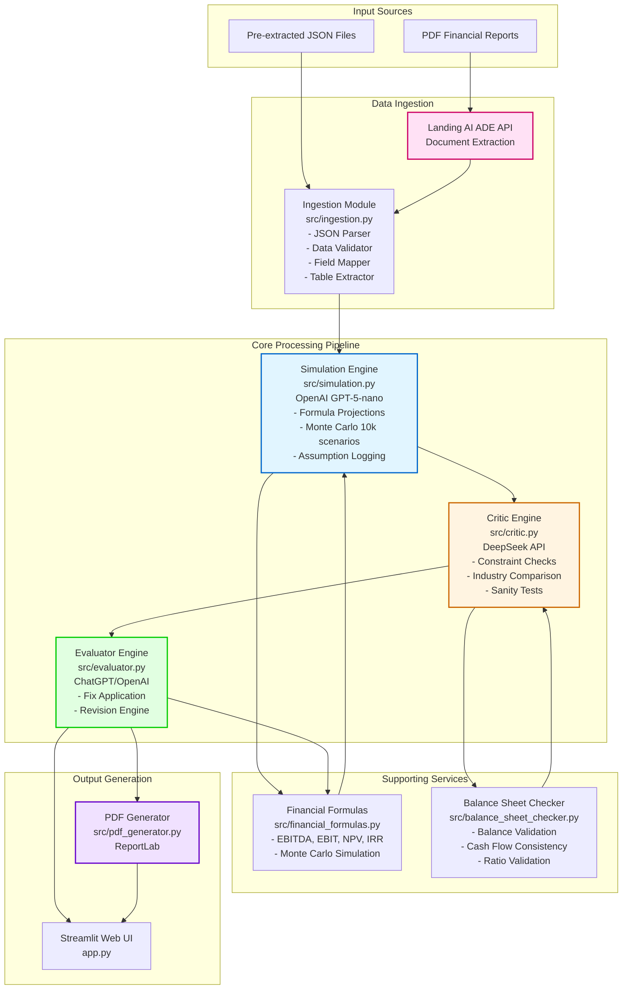
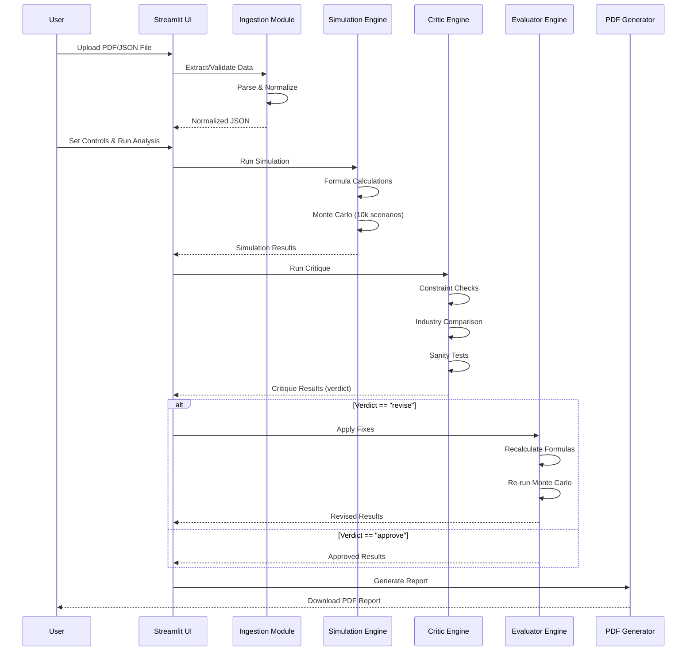

# Project Summary

## Overview

This project implements a complete financial analysis pipeline that processes Landing AI ADE JSON data through multiple AI-powered stages to generate comprehensive financial reports.

## Architecture

### System Architecture Diagram



### Components

1. **Ingestion Module** (`src/ingestion.py`)
   - Loads and validates Landing AI ADE JSON files
   - Extracts KPIs and field references
   - Validates report structure

2. **Simulation Engine** (`src/simulation.py`)
   - Uses OpenAI GPT-5-nano for formula-driven projections
   - Runs 10,000 Monte Carlo scenarios
   - Logs assumptions and traceability
   - Falls back to local calculations if API fails

3. **Critic Engine** (`src/critic.py`)
   - Uses DeepSeek API for forensic review
   - Validates balance sheet constraints
   - Checks cash flow consistency
   - Compares against industry averages
   - Runs sanity tests
   - Provides verdict (approve/revise) and suggested fixes

4. **Evaluator Engine** (`src/evaluator.py`)
   - Uses ChatGPT/OpenAI for applying critic fixes
   - Deterministically applies corrections
   - Generates revised simulation if needed
   - Creates final assumption log

5. **PDF Generator** (`src/pdf_generator.py`)
   - Generates professional PDF reports
   - Includes all analysis results
   - Uses ReportLab for PDF creation

6. **Financial Formulas** (`src/financial_formulas.py`)
   - EBITDA, EBIT, Net Income calculations
   - Free Cash Flow calculation
   - NPV and IRR calculations
   - Monte Carlo simulation
   - Percentile calculations

7. **Balance Sheet Checker** (`src/balance_sheet_checker.py`)
   - Validates balance sheet balancing
   - Checks cash flow consistency
   - Validates financial ratios
   - Checks historical ranges

### User Interface

**Streamlit App** (`app.py`)
- PDF/JSON file upload
- JSON preview
- Scenario control sliders
- Real-time debate logs
- Results visualization
- PDF export

## Data Flow



### Text Flow

```
Landing AI ADE JSON
    ↓
Ingestion Module (Validation & Extraction)
    ↓
Simulation Engine (Formula Projections + Monte Carlo)
    ↓
Critic Engine (Forensic Review)
    ↓
Evaluator Engine (Apply Fixes)
    ↓
PDF Generator (Final Report)
```

## Key Features

### 1. Formula-Driven Projections
- Uses exact KPIs from report JSON
- Applies user-controlled scenario deltas
- Shows explicit formulas and inputs
- Provides traceability to source documents

### 2. Monte Carlo Simulation
- 10,000 scenarios per analysis
- Normal distribution by default
- Calculates median, 10th, and 90th percentiles
- Tracks scenario drivers

### 3. Constraint Checking
- Balance sheet validation (Assets = Liabilities + Equity)
- Cash flow consistency checks
- Financial ratio validation
- Historical range validation

### 4. Industry Comparison
- Compares KPIs against industry averages
- Flags deviations > 100 bps
- Requires justification for deviations

### 5. Explainability
- Full assumption log
- Traceability to source documents
- Formula documentation
- Impact analysis

## API Integration

### OpenAI API
- Model: GPT-5-nano (custom endpoint)
- Fallback: GPT-4-turbo-preview (standard API)
- Fallback: Local simulation (if API fails)

### DeepSeek API
- Model: deepseek-chat
- Fallback: Local constraint checks (if API fails)

### ChatGPT API
- Model: GPT-4-turbo-preview
- Fallback: OpenAI API key
- Fallback: Local fix application (if API fails)

## Testing

### Unit Tests
- `tests/test_financial_formulas.py`: Tests all financial formulas
- `tests/test_balance_sheet_checker.py`: Tests constraint checking

### Test Coverage
- Financial formula calculations
- Balance sheet validation
- Cash flow consistency
- Financial ratio validation
- Historical range checking

## Error Handling

- API failures fall back to local calculations
- Invalid JSON is caught and reported
- Missing fields are handled gracefully
- Constraint violations are logged
- All errors are logged with full tracebacks

## Performance

- Async API calls for parallel processing
- Local Monte Carlo simulation (fast)
- Efficient PDF generation
- Streamlit app with real-time updates

## Security

- API keys stored in environment variables
- .env file excluded from version control
- No hardcoded credentials
- Secure API communication

## Extensibility

### Adding New Financial Formulas
1. Add formula function to `src/financial_formulas.py`
2. Add test to `tests/test_financial_formulas.py`
3. Update simulation engine to use new formula

### Adding New Constraint Checks
1. Add check function to `src/balance_sheet_checker.py`
2. Add test to `tests/test_balance_sheet_checker.py`
3. Update critic engine to use new check

### Customizing Prompts
1. Edit prompts in `src/simulation.py`, `src/critic.py`, `src/evaluator.py`
2. Adjust temperature and other parameters
3. Test with sample data

## Future Enhancements

1. **PDF Parsing**: Direct PDF upload and parsing (currently requires JSON)
2. **Database Integration**: Store results in database
3. **Batch Processing**: Process multiple reports at once
4. **Advanced Visualizations**: Charts and graphs in PDF and Streamlit
5. **Export Formats**: Excel, CSV, JSON exports
6. **User Authentication**: Secure access to the Streamlit app
7. **Historical Analysis**: Track changes over time
8. **Custom Reports**: User-defined report templates

## Dependencies

- `openai`: OpenAI API client
- `streamlit`: Web app framework
- `pandas`: Data manipulation
- `numpy`: Numerical computations
- `python-dotenv`: Environment variable management
- `aiohttp`: Async HTTP client
- `reportlab`: PDF generation
- `pytest`: Testing framework

## License

This project is provided as-is for educational and research purposes.

## Contributors

Built as part of a hackathon project.

## Version

Version 1.0.0 - Initial release

