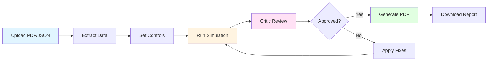

# Quick Start Guide

## Installation (5 minutes)

1. **Install dependencies**:
   ```bash
   pip install -r requirements.txt
   ```

2. **Set up environment variables**:
   ```bash
   # Create .env file
   echo "LANDINGAI_API_KEY=YOUR_LANDINGAI_API_KEY" > .env
   echo "OPENAI_API_KEY=YOUR_OPENAI_API_KEY" >> .env
   echo "DEEPSEEK_API_KEY=YOUR_DEEPSEEK_API_KEY" >> .env
   ```
   
   Note: The Landing AI API key can also be set as `VISION_AGENT_API_KEY` (used by the official library).

## Running the Streamlit App (Recommended)

1. **Start the app**:
   ```bash
   streamlit run app.py
   ```

2. **Open your browser** to `http://localhost:8501`

3. **Upload a file**:
   - **PDF File**: Upload a PDF file and click "Extract Data from PDF" to use Landing AI ADE API
   - **JSON File**: Upload a pre-extracted JSON file (e.g., `sample_data/sample_report.json`)

4. **Adjust scenario controls** using the sliders in the sidebar

5. **Click "Run Analysis"** to start the pipeline

6. **View results** in the tabs:
   - **JSON Preview**: See the uploaded data
   - **Results**: View simulation, critique, and evaluation results
   - **Debate Logs**: Watch real-time logs of the analysis
   - **Export**: Download the final PDF report

## Running from Command Line

1. **Run with sample data**:
   ```bash
   python main.py sample_data/sample_report.json output.pdf
   ```

2. **Run with custom parameters**:
   ```bash
   python main.py sample_data/sample_report.json output.pdf \
     --opex-delta-bps -50 \
     --revenue-delta-bps 0 \
     --discount-rate-base 0.08 \
     --discount-rate-delta-bps -200
   ```

## Running the Example Script

```bash
python example_usage.py
```

This will run the complete pipeline with the sample data and display results in the console.

## Running Tests

```bash
# Run all tests
pytest tests/

# Run specific test file
pytest tests/test_financial_formulas.py
pytest tests/test_balance_sheet_checker.py
```

## Pipeline Flow



## Understanding the Output

### Simulation Results
- **Formula Projections**: Calculated values using financial formulas
- **Monte Carlo Results**: Statistics from 10,000 scenarios (median, 10th, 90th percentiles)

### Critic Review
- **Verdict**: `approve` or `revise`
- **Constraint Checks**: Balance sheet and cash flow validation
- **Suggested Fixes**: Issues that need to be addressed (if verdict is `revise`)

### Evaluation Results
- **Status**: `approved` or `revised`
- **Applied Fixes**: Fixes that were applied to the simulation
- **Final Simulation**: Updated simulation results after applying fixes

### PDF Report
The PDF report includes:
- Executive summary
- Formula-driven projections
- Monte Carlo simulation results
- Assumption log
- Critic review
- Applied fixes

## Troubleshooting

### API Key Errors
- Verify your API keys are correct in the `.env` file
- Check that the `.env` file is in the project root
- Ensure `python-dotenv` is installed

### Import Errors
- Make sure you're in the project root directory
- Verify all dependencies are installed: `pip install -r requirements.txt`

### API Connection Issues
- Check your internet connection
- Verify API keys are valid
- The pipeline will fall back to local calculations if APIs fail

## Next Steps

1. **Customize the prompts**: Edit the prompts in `src/simulation.py`, `src/critic.py`, and `src/evaluator.py`

2. **Add more financial formulas**: Extend `src/financial_formulas.py` with additional calculations

3. **Enhance the UI**: Modify `app.py` to add more features to the Streamlit app

4. **Add more tests**: Create additional test cases in the `tests/` directory

5. **Integrate with Landing AI**: Connect to the Landing AI API to automatically extract data from PDFs

## Support

For issues or questions:
1. Check the README.md for detailed documentation
2. Review the ENV_SETUP.md for environment setup help
3. Check the example_usage.py for code examples

